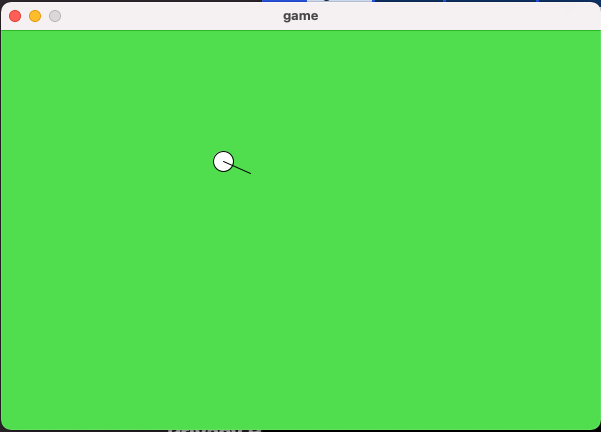

# Intro

A 2D multiplayer game based on [surviv.io](surviv.io) that I built to understand the logic between basic movement concepts in games, and to understand the data that needs to be transferred in a basic multiplayer game.

Currently, it looks like this:



# Getting Started

Download and install [Processing](https://processing.org/download) (a Java based framework for building UIs with ease).

Download and install [Git](https://git-scm.com/downloads).

Run:

```bash
git clone git@github.com:zvikfir/2d-game.git
```

Open the `game.pde` file with `Processing`, and press the run button.